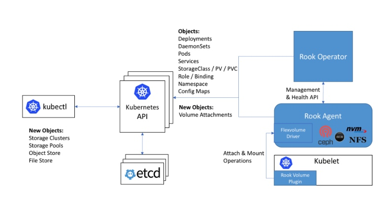
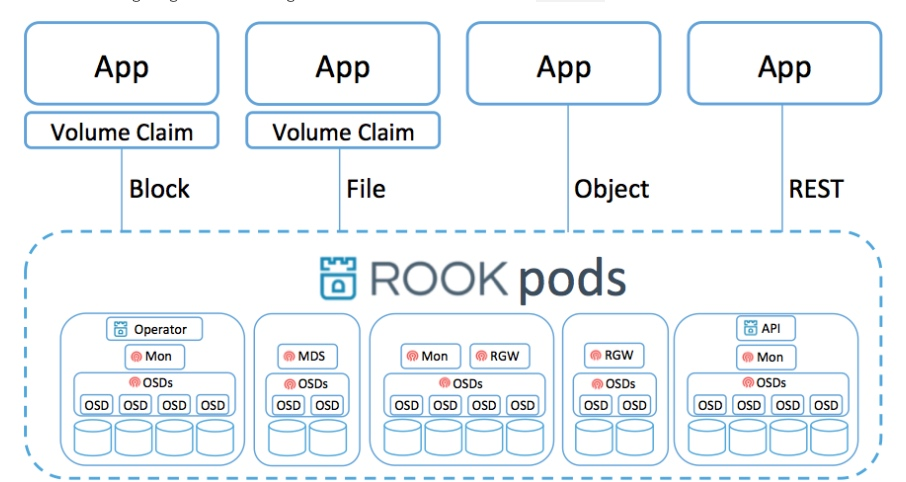
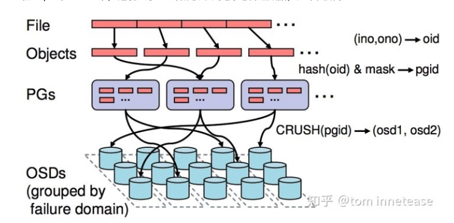
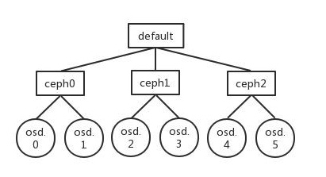
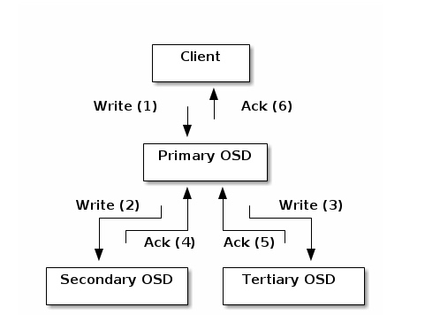

# 储存插件 Rook & ceph
## Rook是什么
Rook是一个自管理的分布式储存编排系统。是kubernetes和储存系统之间的适配层。
### Rook的架构：

* `Rook 与kubernetes的交互`
* Rook底下包装了多种储存引擎，其中包括被广泛使用的ceph，
* ceph本身已经是一个分布式高可用的储存引擎，但是他的设置相对比较静态，动态扩容缩容不是很方便，也比较复杂，所以出现了Rook这种对ceph的包装

* `Rook 与 ceph的交互`
* Rook会封装了ceph后，让ceph运行在一个一个pod里，还兼容了kubernetes的声明式编程。
* Rook为kubernetes提供PV，这样客户端可以用pvc来消费这些储存实例

* `ceph本身的分布式储存`
* 一个file会被打散成若干个object
* 对object的id进行hash，分配到一个Placement group去，
    * placement group是一个很好的设计，它不把文件直接hash然后储存到一个磁盘中是因为有了PG可以实现：
    * 在不同的failure domain存放replica
    * 纠错码（当然也可以在不同的failure domain）
        * 纠错码是一种类似于raid5的故障恢复手段。比raid5更可靠的是ceph可以把erasure code存放多个副本
    * 故障恢复，负载均衡
    * failure domain是指一般这块东西一起故障的，例如一台电脑故障，那么他上面挂的5个硬盘都会挂，那么这5个硬盘属于一个failure domain。例如一个交换机挂了，这个路由器下的所有电脑的所有硬盘都可以定义为一个failure domian
* 一个Placement group会根据CRUSH算法分配到一个或多个failure domain里的OSD里面
    * CRUSH类似于一致性哈希，但是又有分配纠错码或备份储存位置的能力
* OSD是真正储存东西的目录。
* 客户端在知道了访问的对象在哪个osd后是直接访问这个osd的，不经过任何proxy

### Ceph CRUSH Map

### ceph replicated io

* ceph会储存完所有备份才返回成功给客户端（强一致）。

### Rook由Operator和Cluster两部分组成：
* Operator：是一个包含所有储存集群的bootstrap和monitor的镜像，rook operator还会在每个kubernetes的node上创建rook agents，
* Cluster：负责创建CRD对象，指定相关参数，包括ceph镜像、元数据持久化位置、磁盘位置、dashboard等等…
## references
* [rook简单说明](!https://rook.io/docs/rook/v1.0/ceph-storage.html)
* [官方架构说明](!https://access.redhat.com/documentation/en-us/red_hat_ceph_storage/1.2.3/html/red_hat_ceph_architecture/storage_cluster_architecture)
* [CRUSH算法的原理与实现](!https://zhuanlan.zhihu.com/p/58888246)
