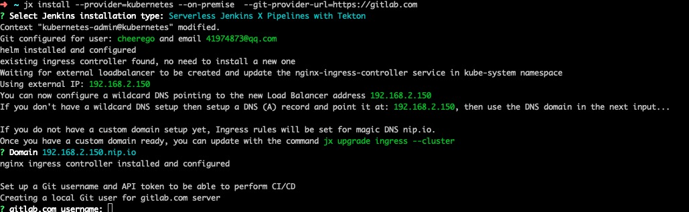

# 安装Jenkins X

## helm 源
```
https://github.com/BurdenBear/kube-charts-mirror
```

## 安装Jenkins X

### 下载JX
```bash
mkdir -p ~/.jx/bin
curl -L https://github.com/jenkins-x/jx/releases/download/v2.0.329/jx-linux-amd64.tar.gz | tar xzv -C ~/.jx/bin
export PATH=$PATH:~/.jx/bin
echo 'export PATH=$PATH:~/.jx/bin' >> ~/.bashrc

```

### 安装JX
```
本地安装我碰到了这个错，然后加上了--on-premise好了
existing ingress controller found, no need to install a new one
Waiting for external loadbalancer to be created and update the nginx-ingress-controller service in kube-system namespace
FATAL: ingress init failed: service jxing-nginx-ingress-controller never became ready
为什么好，jenkins作者的说的，毕竟是大佬
https://github.com/jenkins-x/jx/issues/1026


jx install --provider=kubernetes --on-premise  --git-provider-url=https://gitlab.com  --docker-registry=gcr.azk8s.cn
```

### 切换helm源
```yaml
https://jenkins-x.io/faq/issues/


➜  ~ helm repo list
NAME     	URL
stable   	https://kubernetes-charts.storage.googleapis.com
local    	http://127.0.0.1:8879/charts
jenkins-x	https://storage.googleapis.com/chartmuseum.jenkins-x.io


helm repo remove jenkins-x 
helm repo add jenkins-x	http://chartmuseum.jenkins-x.io

helm repo remove stable 
helm repo add stable http://mirror.azure.cn/kubernetes/charts
```




### 可能会遇到的问题

* googlestorage上面的helm下载不下来
```bash
cd .jx/bin
wget https://get.helm.sh/helm-v2.14.1-linux-amd64.tar.gz
mv helm-v2.14.1-linux-amd64.tar.gz helm.tgz
```

* k8s.gcr.io/defaultbackend:1.4 下载不下来

```
docker pull registry.aliyuncs.com/google_containers/defaultbackend:1.4 && \
docker tag registry.aliyuncs.com/google_containers/defaultbackend:1.4 k8s.gcr.io/defaultbackend:1.4
```

* kubectl get pod no resouce found

```
jenkins x 的吧默认的namespace给改了
vim ~/.kube/config
- context:
    cluster: kubernetes
    namespace: default    这个位置改成default
    user: kubernetes-admin
  name: kubernetes-admin@kubernetes
```

* 可能会出现git clone 不下来的情况
```bash
mkdir -p /root/.jx/draft/packs/github.com/jenkins-x-buildpacks
cd /root/.jx/draft/packs/github.com/jenkins-x-buildpacks
git clone  https://github.com/jenkins-x-buildpacks/jenkins-x-kubernetes.git
```

